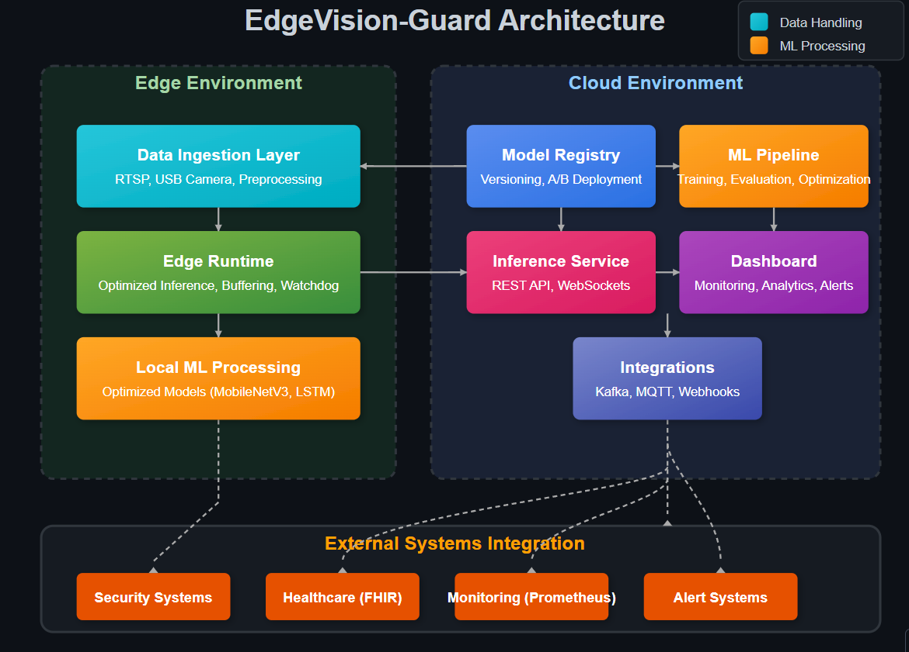

# sentinelAI-safetyMonitoring

<div align="center">
<div style="height: 200px; overflow: hidden; display: flex; justify-content: center;">
  <picture>
    <source media="(prefers-color-scheme: dark)" srcset="images/main-dark.png" width="750" style="object-fit: cover; object-position: center 40%;">
    <source media="(prefers-color-scheme: light)" srcset="images/main-light.png" width="750" style="object-fit: cover; object-position: center 40%;">
    
  </picture>
</div>

  <h3>Real-Time Fall Detection & Anomaly Alert Platform</h3>

[](https://github.com/muhkartal/Real-Time-Fall-Detection-and-Anomaly-Alert-System)
[](https://github.com/muhkartal/Real-Time-Fall-Detection-and-Anomaly-Alert-System/commits/main)
[](https://github.com/muhkartal/Real-Time-Fall-Detection-and-Anomaly-Alert-System)
[](https://github.com/muhkartal/Real-Time-Fall-Detection-and-Anomaly-Alert-System)
[](LICENSE)
[](https://www.python.org/downloads/)
[](https://www.docker.com/)

</div>

## Overview

EdgeVision-Guard is a monitoring system using computer vision and deep learning to detect human falls and anomalies in real-time. The platform uses a privacy-preserving approach based on skeleton keypoints, making it suitable for healthcare facilities, workplace safety monitoring, and smart living environments.

## Contents

<div align="center">
<table>
  <tr>
    <td align="center" width="20%"><a href="#features"><b>Features</b></a></td>
    <td align="center" width="20%"><a href="#deployment-guide"><b>Deployment</b></a></td>
    <td align="center" width="20%"><a href="#architecture-deep-dive"><b>Architecture</b></a></td>
    <td align="center" width="20%"><a href="#integration-examples"><b>Integration</b></a></td>
    <td align="center" width="20%"><a href="#development--customization"><b>Development</b></a></td>
  </tr>
</table>
</div>

## Features

### Technical Architecture

-  **Advanced Computer Vision Pipeline**

   -  MobileNetV3-Small extracts spatial features from MediaPipe skeleton keypoints
   -  Bidirectional LSTM captures temporal patterns and contextual information
   -  Hierarchical feature fusion for robust anomaly detection

-  **Multi-Tier Deployment Architecture**

   -  Cloud-tier with horizontal scaling for monitoring centers
   -  Edge-tier with optimized inference for on-premise deployment
   -  Centralized model registry with versioning and A/B deployment capabilities

-  **Comprehensive Integration Options**

   -  REST API and WebSockets for real-time data streams
   -  Kafka connector for event bus integration
   -  MQTT support for IoT/edge device communication
   -  Webhook notifications for alerting systems

-  **Security & Privacy**

   -  Role-based access control for dashboard and APIs
   -  Audit logging for all system activities and alerts
   -  Data encryption in-transit and at-rest
   -  GDPR-ready with data minimization principles
   -  HIPAA-compliant deployment options for healthcare settings

-  **Scalable Infrastructure**
   -  Microservice architecture for independent scaling
   -  Container orchestration with Kubernetes support
   -  Multi-region deployment ready
   -  Configurable retention policies

### Performance & Optimization

-  **Model Optimization Techniques**

   -  INT8 quantization reduces model size by 75% without significant accuracy loss
   -  TensorRT acceleration for NVIDIA platforms increases throughput by 3x
   -  ARM-optimized inference for Raspberry Pi and Jetson Nano devices
   -  Support for hardware acceleration (CUDA, OpenVINO, CoreML)

-  **Production Performance Metrics**

   | Deployment Target | Latency | Throughput | Power Consumption |
   | ----------------- | ------- | ---------- | ----------------- |
   | Cloud (GPU)       | 12ms    | 83 FPS     | N/A               |
   | Cloud (CPU)       | 45ms    | 22 FPS     | N/A               |
   | Jetson Nano       | 78ms    | 12 FPS     | 5W                |
   | Raspberry Pi 4    | 126ms   | 8 FPS      | 3.2W              |

-  **Model Accuracy Benchmarks**

   | Metric              | UP-Fall Dataset | URFall Dataset | Real-World Validation |
   | ------------------- | --------------- | -------------- | --------------------- |
   | Precision           | 0.94            | 0.92           | 0.91                  |
   | Recall              | 0.91            | 0.89           | 0.88                  |
   | F1 Score            | 0.92            | 0.90           | 0.89                  |
   | ROC-AUC             | 0.97            | 0.95           | 0.94                  |
   | False Positive Rate | 0.04            | 0.05           | 0.06                  |
   | False Negative Rate | 0.09            | 0.11           | 0.12                  |

## Deployment Guide

### System Requirements

#### Production Environment

-  **Cloud Deployment**

   -  Kubernetes 1.22+ or Docker Swarm
   -  4+ vCPUs, 8+ GB RAM per node
   -  NVIDIA GPU (optional but recommended)
   -  Redis 6.0+ for caching and pub/sub
   -  S3-compatible object storage for model artifacts

-  **Edge Deployment**
   -  Raspberry Pi 4 (4GB+ RAM) or NVIDIA Jetson Nano
   -  32GB+ SD card or SSD
   -  USB camera or RTSP IP camera
   -  Wired network connection recommended

#### Development Environment

-  Python 3.11+
-  CUDA 11.7+ and cuDNN 8.5+ (for GPU training)
-  Docker and docker-compose
-  16GB+ RAM recommended for training

### Installation Options

#### 1. Docker Deployment

```bash
# Clone the repository
git clone https://github.com/muhkartal/EdgeVision-Guard.git
cd EdgeVision-Guard

# Configure environment variables
cp .env.example .env
# Edit .env with your configuration

# Deploy with Docker Compose
docker-compose up -d
```

#### 2. Kubernetes Deployment

```bash
# Install Helm chart
helm repo add edgevision-guard https://charts.yourdomain.com/
helm repo update

# Deploy EdgeVision-Guard
helm install edgevision-guard edgevision-guard/edgevision-guard \
  --namespace monitoring \
  --create-namespace \
  --set ingress.enabled=true \
  --set persistence.enabled=true \
  --values custom-values.yaml
```

#### 3. Edge Device Deployment

```bash
# Deploy to edge device
./scripts/deploy-edge.sh --target <device-ip> --username <user> --key <ssh-key>

# Or use the edge-specific Docker Compose
docker-compose -f docker-compose.edge.yml up -d

# Install as systemd service
sudo cp deployment/edgevision-guard.service /etc/systemd/system/
sudo systemctl enable edgevision-guard.service
sudo systemctl start edgevision-guard.service
```

### Model Training & Customization

```bash
# Download and preprocess datasets
python src/data_ingest.py --dataset up-fall --output data/up-fall
python src/data_ingest.py --dataset ur-fall --output data/ur-fall
python src/data_ingest.py --generate-keypoints --dataset up-fall --dataset ur-fall

# Train with dataset
python src/train.py --epochs 100 --batch-size 64 --device cuda --output-dir models/

# Fine-tune on custom data
python src/train.py --transfer-learning --base-model models/fall_detector.pth \
  --custom-data path/to/custom/data --epochs 20

# Export to production-ready ONNX format
python src/onnx_export.py --model-path models/fall_detector.pth \
  --output models/fall_detector.onnx --quantize --benchmark
```

## Architecture Deep Dive

<picture>
  <source media="(prefers-color-scheme: dark)" srcset="images/dark-mode.png">
  <source media="(prefers-color-scheme: light)" srcset="images/light-mode.png">
  
</picture>

### Component Breakdown

1. **Data Ingestion Layer**

   -  Supports multiple video sources (RTSP, HTTP, local camera)
   -  Frame sampling and preprocessing pipeline
   -  Privacy-first approach with immediate skeleton extraction

2. **ML Processing Pipeline**

   -  Modular architecture with pluggable components
   -  Feature extraction with MobileNetV3-Small (optimized for mobile/edge)
   -  Temporal sequence processing with bidirectional LSTM
   -  Anomaly detection with confidence scoring

3. **Inference Service**

   -  REST API with OpenAPI documentation
   -  WebSocket streaming for real-time applications
   -  Inference result caching for performance optimization
   -  Horizontal scaling capabilities

4. **Dashboard**

   -  Role-based access control with SSO integration
   -  Real-time monitoring with alert management
   -  Historical data analytics with filtering and search
   -  Explainable AI visualizations with Grad-CAM
   -  Configurable alert thresholds and notification rules

5. **Edge Runtime**
   -  Optimized container for constrained environments
   -  Watchdog monitoring with auto-recovery
   -  Local buffering for network interruptions
   -  OTA update capability

## Integration Examples

### Security System Integration

```python
# Configure webhook notifications to your security system
WEBHOOK_URL = "https://your-security-system.com/api/events"
WEBHOOK_AUTH = {"Authorization": "Bearer your-api-token"}

# In your .env file
ALERT_WEBHOOK_URL=https://your-security-system.com/api/events
ALERT_WEBHOOK_AUTH_HEADER=Bearer your-api-token
```

### Healthcare System Integration

```python
# Configure HL7 FHIR integration
FHIR_SERVER = "https://fhir.hospital.org/api/fhir/r4"
FHIR_AUTH = {"Authorization": "Bearer your-fhir-token"}

# In your .env file
FHIR_ENABLED=true
FHIR_SERVER_URL=https://fhir.hospital.org/api/fhir/r4
FHIR_AUTH_HEADER=Bearer your-fhir-token
```

### Monitoring Integration

```python
# Prometheus metrics configuration
METRICS_ENABLED=true
METRICS_PORT=9090

# Grafana dashboard provisioning
GRAFANA_API_KEY=your-grafana-api-key
GRAFANA_URL=https://grafana.yourdomain.com
```

## Administration & Maintenance

### System Monitoring

EdgeVision-Guard exposes Prometheus metrics at `/metrics` for monitoring:

| Metric                                 | Description                        |
| -------------------------------------- | ---------------------------------- |
| `edgevision_inference_requests_total`  | Total number of inference requests |
| `edgevision_inference_latency_seconds` | Histogram of inference latencies   |
| `edgevision_anomaly_detections_total`  | Total number of anomalies detected |
| `edgevision_false_positive_rate`       | Estimated false positive rate      |
| `edgevision_model_version`             | Current model version in use       |

### Backup & Disaster Recovery

```bash
# Backup configuration and models
./scripts/backup.sh --output backup.tar.gz

# Restore from backup
./scripts/restore.sh --input backup.tar.gz
```

### Model Management

```bash
# List available models
./scripts/model-manager.sh list

# Register new model
./scripts/model-manager.sh register --model-path models/new_model.onnx --version 1.2.0

# Switch active model
./scripts/model-manager.sh activate --version 1.2.0
```

## Development & Customization

### Environment Setup

```bash
# Create development environment
python -m venv venv
source venv/bin/activate  # On Windows: venv\Scripts\activate

# Install development dependencies
pip install -r requirements-dev.txt

# Install pre-commit hooks
pre-commit install
```

### Code Quality & Testing

```bash
# Run linting
ruff check .

# Run tests with coverage
pytest tests/ --cov=src/ --cov-report=html

# Format code
black .
```

### Custom Model Development

```bash
# Create custom model architecture
python src/model.py --custom-architecture config/custom_model.yaml

# Hyperparameter tuning
python src/hyperopt.py --config config/hyperparameter_space.yaml
```

## Project Structure

```
EdgeVision-Guard/
├─ README.md                      # This file
├─ requirements.txt               # Production dependencies
├─ requirements-dev.txt           # Development dependencies
├─ data/                          # Data directory
│  └─ (download script populates)
├─ src/                           # Source code
│  ├─ __init__.py                 # Package initialization
│  ├─ data_ingest.py              # Dataset download and preprocessing
│  ├─ model.py                    # ML model architecture
│  ├─ train.py                    # Training pipeline
│  ├─ onnx_export.py              # Model export and optimization
│  ├─ inference_service/          # API service
│  │  ├─ __init__.py
│  │  ├─ app.py                   # FastAPI application
│  │  └─ utils.py                 # Utility functions
│  └─ dashboard/                  # User interface
│     ├─ __init__.py
│     ├─ app.py                   # Streamlit dashboard
│     └─ explainer.py             # Explainability visualizations
├─ docker/                        # Dockerfiles
│  ├─ Dockerfile                  # Cloud deployment (x86_64)
│  └─ Dockerfile.edge             # Edge deployment (arm64)
├─ deployment/                    # Deployment configurations
│  ├─ kubernetes/                 # K8s manifests
│  └─ edge/                       # Edge deployment scripts
├─ scripts/                       # Administration scripts
├─ .github/                       # CI/CD configuration
│  └─ workflows/
│     ├─ ci.yml                   # Continuous Integration
│     └─ cd.yml                   # Continuous Deployment
└─ tests/                         # Test suite
   └─ test_inference.py           # Inference tests
```

## Security Considerations

-  All endpoints should be secured behind authentication
-  API keys should be rotated regularly
-  For medical or healthcare deployments, ensure HIPAA compliance
-  Regular security audits are recommended

## Compliance & Regulations

EdgeVision-Guard is designed with compliance in mind:

| Regulation | Compliance Approach                               |
| ---------- | ------------------------------------------------- |
| GDPR       | Data minimization through skeleton-based analysis |
| HIPAA      | Protected health information safeguards           |
| ISO 27001  | Information security management                   |
| OSHA       | Workplace safety monitoring compliance            |

## License

This project is licensed under the MIT License - see the [LICENSE](LICENSE) file for details.

## Acknowledgements

-  [UP-Fall Detection Dataset](https://sites.google.com/up.edu.mx/har-up/)
-  [UR Fall Detection Dataset](http://fenix.univ.rzeszow.pl/~mkepski/ds/uf.html)
-  [MediaPipe Pose](https://google.github.io/mediapipe/solutions/pose)
-  [PyTorch](https://pytorch.org/)
-  [ONNX Runtime](https://onnxruntime.ai/)

---

<div align="center">
  <p>Developed by Muhammed Ibrahim Kartal | <a href="https://kartal.dev">https://kartal.dev</a></p>
</div>
